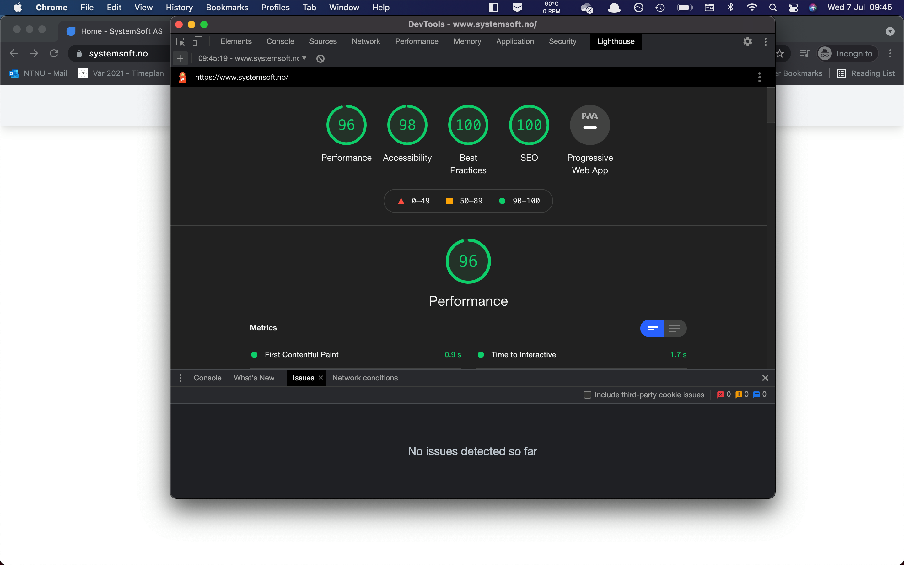

# SystemSoft AS

## Google Lighthouse Rating ✅

## Description ✏️

The official SystemSoft AS website. The website allows employees of SystemSoft AS to easily, independently, and continuously update the company's portfolio.

## Developer Information 🙋🏼‍♂️

Developed by Magnus Rødseth and Julian Grande, summer 2021.

## Stack 🛠

- [Next.js](https://nextjs.org/)
- [TypeScript](https://www.typescriptlang.org/)
- [React](https://reactjs.org/)
- [Tailwind CSS](https://tailwindcss.com/)
- [URQL (GraphQL client)](https://formidable.com/open-source/urql/)
- [GraphQL](https://graphql.org/)
- [Strapi](https://strapi.io/)
- [MongoDB](https://www.mongodb.com/cloud/atlas)
- [DigitalOcean managed PostgreSQL database](https://www.digitalocean.com/products/managed-databases/)
- [Sentry (Error Handling / Tracking)](https://sentry.io/welcome/)
- [SendGrid (automated mail dispatching)](https://sendgrid.com/)

## Frontend Documentation 📄

The documentation for the frontend can be found [here](./frontend/README.md).

## Backend Documentation 📄

The documentation for the backend can be found [here](./backend/README.md).
