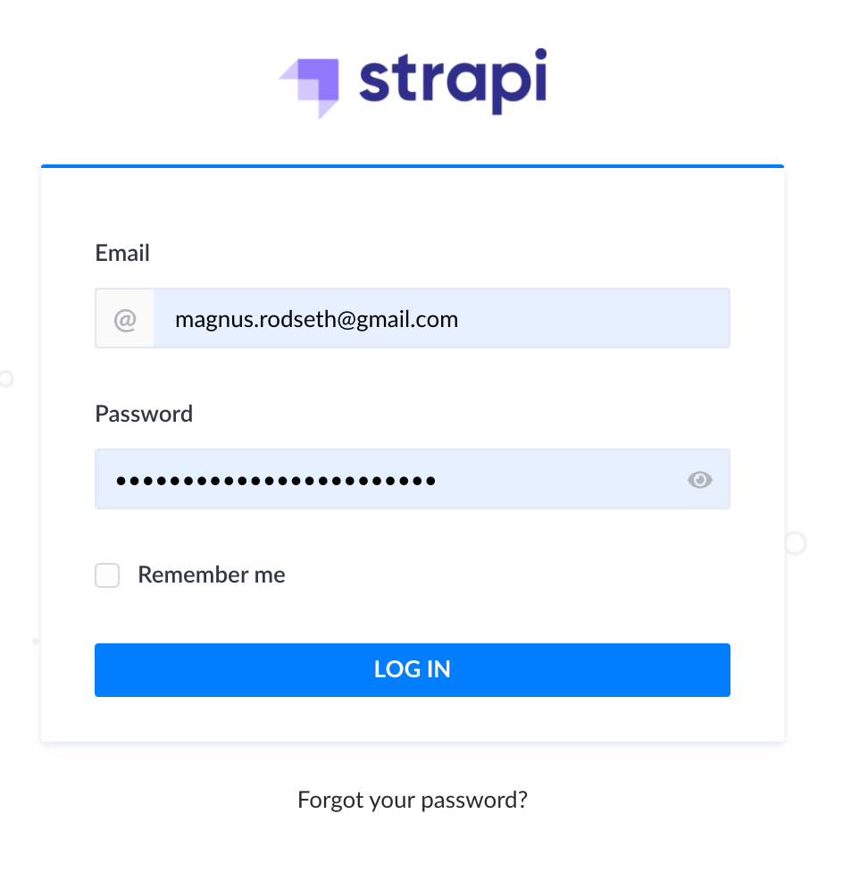
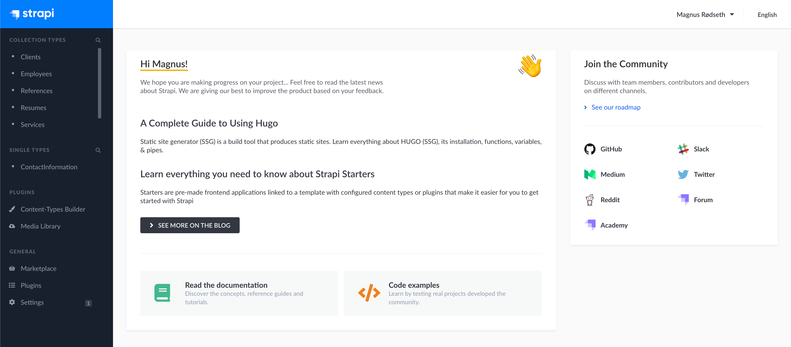
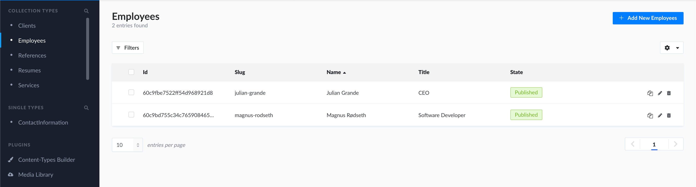

# Logging in as a SystemSoft AS employee ⏩

First, navigate to `www.systemsoft.no/admin`. You should be greeted with the following welcome page, or a similar signup page.

Then, follow the steps to create a user.

After successfully creating a user, you will be taken to this landing page.

On the left, you can see `Collection Types`, `Single Types`, `Plugins` and `General`. You may connect the dots regarding what is what if you have seen the SystemSoft AS website.

`Collection Types` are the meat of the content displayed on your website. For example, if you have 2 employees (_Julian Grande_ and _Magnus Rødseth_), you will see these two employees on the `Employees` content type.

> 💡 Adding, updating and deleting content from the `Collection Types` is really all you need to know about the Strapi backend, as a SystemSoft AS employee. If you have further questions, feel free to contact either Julian Grande or Magnus Rødseth (content information listed below).

## Contact Information 📨

- Julian Grande: [_juliangrande@gmx.com_](mailto:juliangrande@gmx.com)

- Magnus Rødseth: [_magnus.rodseth@gmail.com_](mailto:magnus.rodseth@gmail.com)
