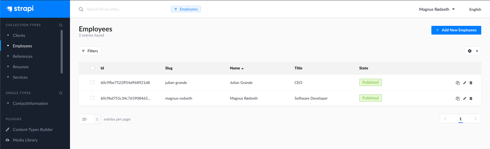
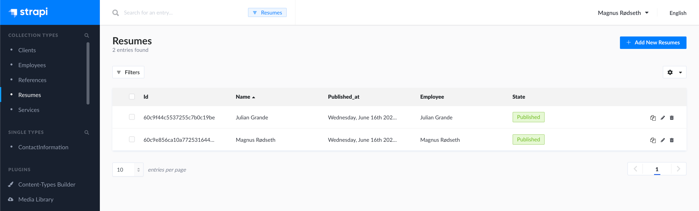
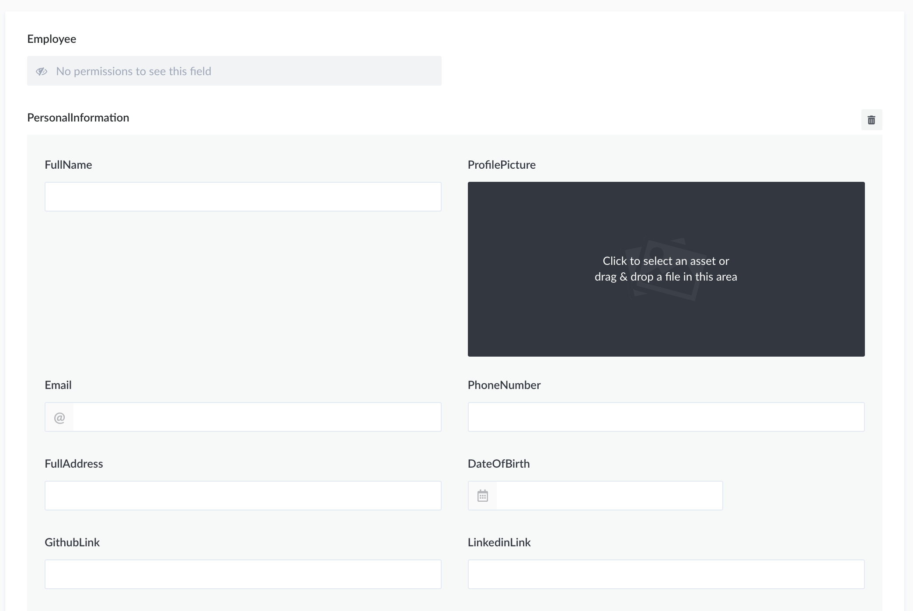
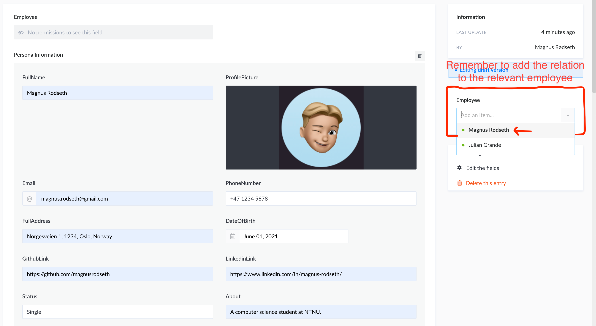

# Creating a resume 📄

First, make sure you have created an `Employee` collection type in Strapi.

Then, navigate to `Resumes` and click **Add new Resumes** to create your new resume.

Now, simply follow the layout and fill out your resume. **Note that some fields are required, and some are optional. More on this later.**

Before saving and publishing, please **remember to relate the resume to you as an employee**.

> 💡 Due to a current bug in Strapi, it is very important that you only link your personal resume to your `Employee` entity.

Now that you've finished your resume and linked it to your `Employee` entity, it is time to click **save** and **publish**.

> 💡 If nothing happens when you click **publish**, it is likely because you have forgotten a required field in your resume. Please scroll through your resume and look for any red alerts.

You should be able to see your resume on the website within a few minutes.
