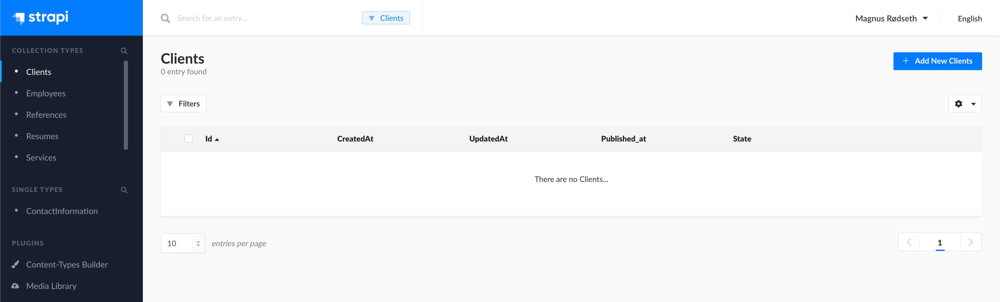
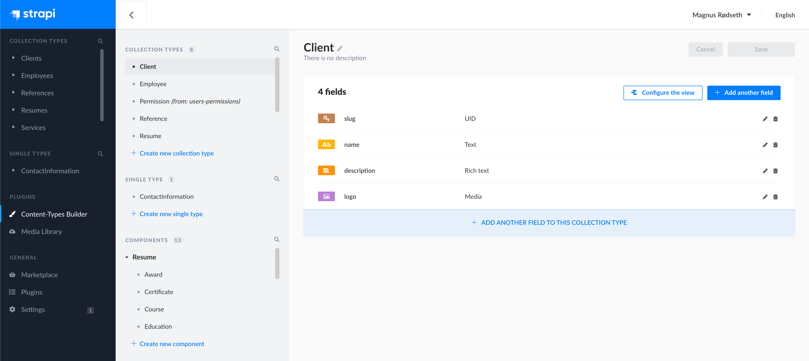
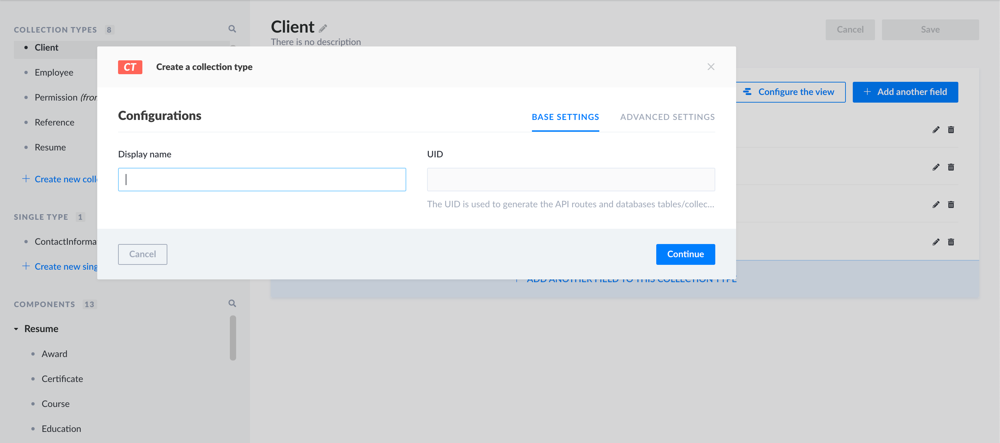
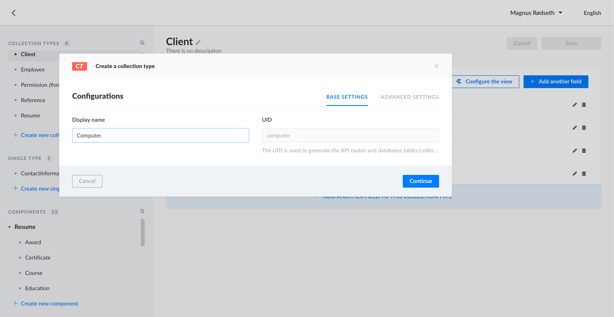

# Collection Types ✏️

`Collection Types` is a term for systematically grouping the content on the website using Strapi backend.

## Creating a new collection type

First, navigate to the `Content-Types Builder` under `Plugins`.

Then, click the `Create a new collection type` button to create a new collection type. You will see the following dialogue.

> 💡 Please note that when creating collection types, you enter the name in **singular (not plural! Strapi does this for you post-processing!)**.

For further guidance, please follow [Strapi official documentation](https://strapi.io/documentation/user-docs/latest/content-types-builder/creating-new-content-type.html#creating-a-new-content-type).

## Managing collection types

This part should be pretty straightforward. The [official Strapi documentation](https://strapi.io/documentation/user-docs/latest/content-types-builder/managing-content-types.html#editing-content-types) is very good.
