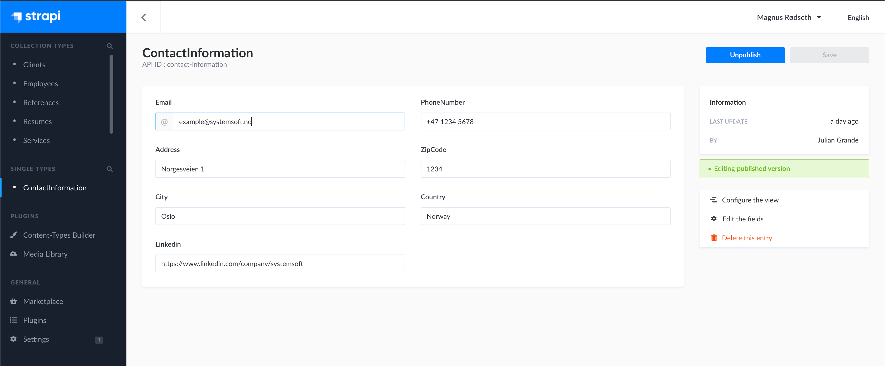

# Contact Information Documentation 📄

The SystemSoft AS website has a footer with the firm's contact information. This is dynamic content, and can be edited in Strapi backend.

First, navigate to the `ContactInformation` in `Single Types`.

Simply fill out the form. Then hit **save** and **publish**.

You should see the changes on the website within a few minutes.

## Contact Information 📨

- Julian Grande: [_juliangrande@gmx.com_](mailto:juliangrande@gmx.com)

- Magnus Rødseth: [_magnus.rodseth@gmail.com_](mailto:magnus.rodseth@gmail.com)
