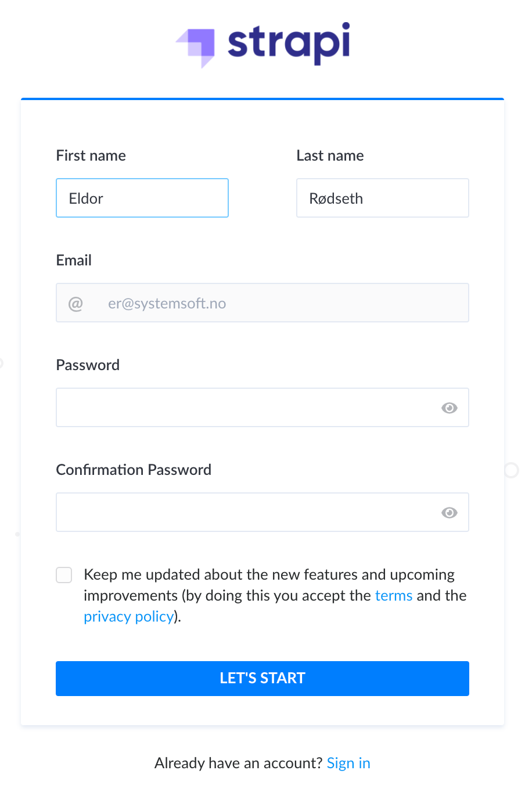

# Logging in as a SystemSoft AS employee ⏩

## Register user

In order to log in as a SystemSoft AS employee, you must use the link provided to you.

This link will take you to Strapi's signup page.

Ensure that your personal information is correct. Your password is encrypted and stored safely.

## Login user

Navigate to `www.systemsoft.no/dashboard`. You should be greeted with the following welcome page.

After successfully logging in as a registered SystemSoft AS employee, you will be taken to this landing page.

Read more about using the Strapi backend [here](./USING_STRAPI.md).

## Contact Information 📨

- Julian Grande: [_juliangrande@gmx.com_](mailto:juliangrande@gmx.com)

- Magnus Rødseth: [_magnus.rodseth@gmail.com_](mailto:magnus.rodseth@gmail.com)
