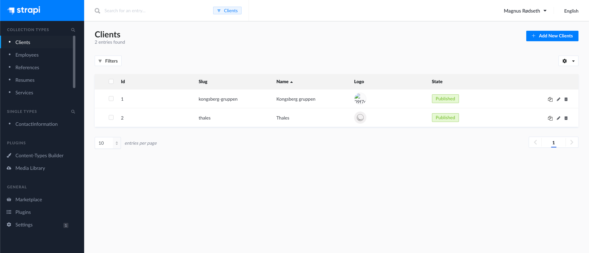
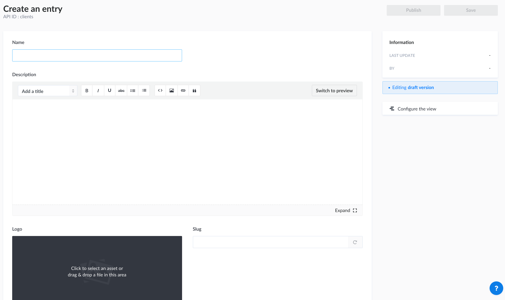
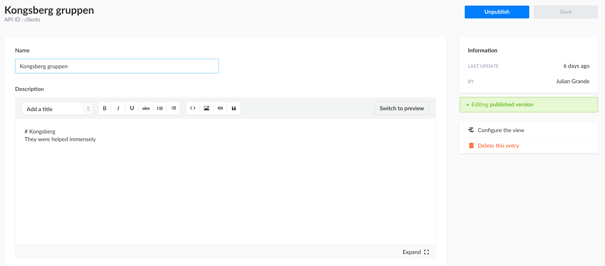

# Using Strapi to manage content ✏️

## Important to note

If you have any questions regarding this section, the developer's contact information can be found on the bottom of this page.

## Overview

After successfully logging in as a registered SystemSoft AS employee, you will be taken to this landing page.

On the left, you can see `Collection Types`, `Single Types`, `Plugins` and `General`. You may connect the dots regarding what is what if you have seen the SystemSoft AS website.

`Collection Types` are the meat of the content displayed on the website. For example, if you have 2 employees (_Julian Grande_ and _Magnus Rødseth_), you will see these two employees on the `Employees` content type.

> 💡 Adding, updating and deleting content from the `Collection Types` is really all you need to know about the Strapi backend, as a SystemSoft AS employee. If you have further questions, feel free to contact either Julian Grande or Magnus Rødseth (content information listed below).

## Adding and updating content

This example uses the `Collection Type` client. The procedure goes for all collection types.

Navigate to `Clients` under `Collection Types` in the sidebar to the left.

Click the `+ Add New Clients` button in the top right. You should now be seeing a view like the image below.

Fill out the relevant information.

> 💡 Please note that **Strapi auto-generates the slug** based on provided information. Hence, there should be **no need to manually enter a slug**. If the slug is not auto-generated for some reason, please enter a sensible value for the slug (example: `magnus-rodseth` as employee slug).

Now that you've finished your content and, it is time to click **save** and **publish**.

> 💡 If nothing happens when you click **publish**, it is likely because you have forgotten a required field in your resume. Please scroll through your resume and look for any red alerts.

You should be able to see your content on the website within a few minutes.

## Deleting content

Click on your piece of existing content. Now, simply click the red `Delete this entry` on the right side of the entry overview.

If promptedm, please confirm deleting the entry.

## Contact Information 📨

- Julian Grande: [_juliangrande@gmx.com_](mailto:juliangrande@gmx.com)

- Magnus Rødseth: [_magnus.rodseth@gmail.com_](mailto:magnus.rodseth@gmail.com)
